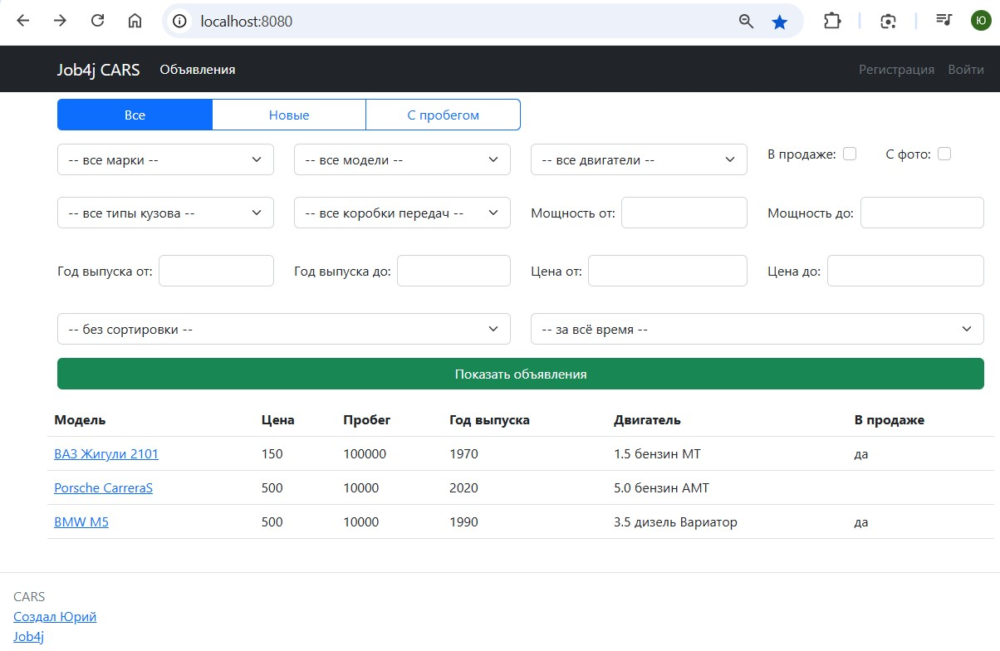
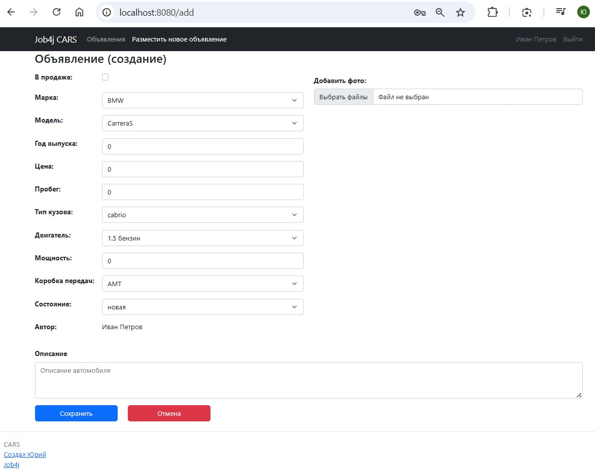
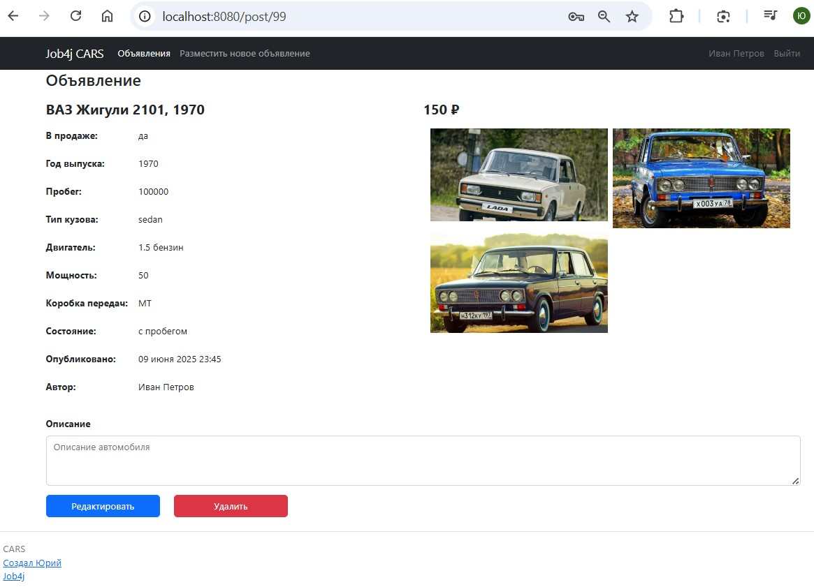
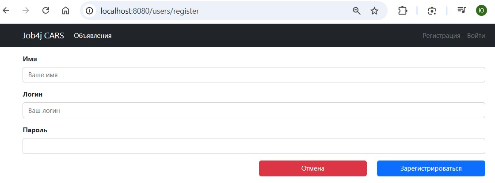
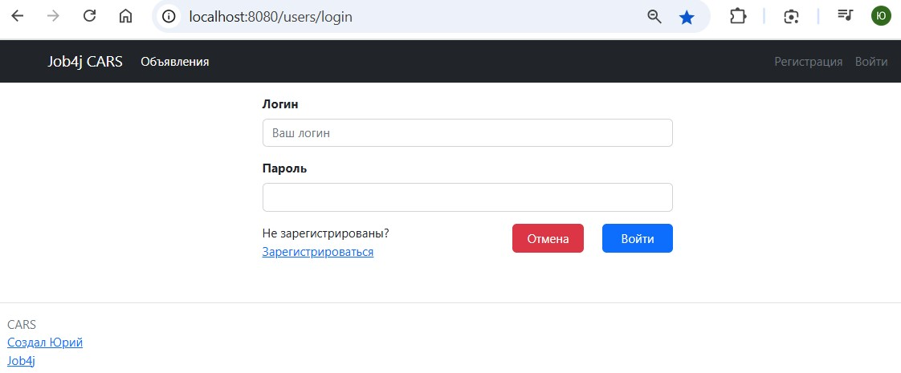

# job4j_cars
Сайт по продаже автомобилей. Позволяет просмотреть список объявлений, отфильтровать его по нужным маркам, моделям и т.п., настроить сортировку. Позволяет добавить новое объявление, изменить существующее.

# Стек технологий:  
Java 19  
PostgreSQL 16.2  
Spring Boot 2.7.6  
Hibernate 5.6.11  
Maven 3.5.1  
Liquibase Maven Plugin 4.15.0  
JaCoCo Maven Plugin 0.8.8

# Требования к окружению
Microsoft Windows 11  
Java 19  
PostgreSQL 16

# Запуск проекта:
Создать локальную копию проекта клонированием из репозитория https://github.com/GitHubfilipich/job4j_cars  
В PostgreSQL создать базу данных и в папке проекта в файлах "...\db\liquibase.properties" и
"...\src\main\resources\application.properties" указать её адрес (url), имя пользователя (username) и
пароль (password).  
Заполнить скрипты заполнения таблиц типов кузова, марок, моделей, двигателей 
(в файле "...\db\scripts\021_dml_insert_body_type_brand_engine_gearboxe_model_data.sql").  
В терминале в папке проекта выполнить скрипты создания БД и заполнения таблиц командой
"mvn liquibase:update -Pproduction".  
Создать исполняемый файл проекта "job4j_cars-1.0-SNAPSHOT.jar" в папке "target" проекта командой
"mvn clean package -Pproduction -DskipTests".  
Запустить исполняемый файл командой "java -jar target/job4j_cars-1.0-SNAPSHOT.jar".  
Сайт проекта находится по адресу http://localhost:8080/

# Взаимодействие с приложением:
Главная страница

Страница просмотра объявления

Страница создания объявления

Страница редактирования объявления

Страница регистрации

Страница аутентификации

# Контакты
https://github.com/GitHubfilipich